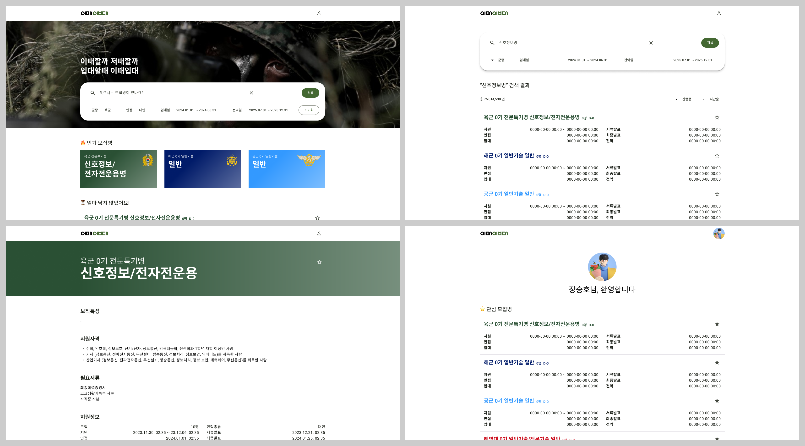

<!-- Improved compatibility of 처음으로 link: See: https://github.com/othneildrew/Best-README-Template/pull/73 -->

<!--
*** Thanks for checking out the Best-README-Template. If you have a suggestion
*** that would make this better, please fork the repo and create a pull request
*** or simply open an issue with the tag "enhancement".
*** Don't forget to give the project a star!
*** Thanks again! Now go create something AMAZING! :D
-->

<!-- PROJECT SHIELDS -->
<!--
*** I'm using markdown "reference style" links for readability.
*** Reference links are enclosed in brackets [ ] instead of parentheses ( ).
*** See the bottom of this document for the declaration of the reference variables
*** for contributors-url, forks-url, etc. This is an optional, concise syntax you may use.
*** https://www.markdownguide.org/basic-syntax/#reference-style-links
-->
[![Contributors][contributors-shield]][contributors-url]
[![Forks][forks-shield]][forks-url]
[![Stargazers][stars-shield]][stars-url]
[![Issues][issues-shield]][issues-url]
[![MIT License][license-shield]][license-url]

<!-- PROJECT LOGO -->
 

  

<h3 align="center">이때입대</h3>

  

    이때할까 저때할까, 입대할때 이때입대
     
    <a href="https://lets-enlist.web.app"><strong>웹사이트 바로가기 »</strong></a>
     
     
    <strong>2024 국방 공공데이터 활용 경진대회 출품작</strong>
     
     
    <a href="https://www.figma.com/design/P2tx7s6MSax8SiALLR6erd/%EC%9D%B4%EB%95%8C%EC%9E%85%EB%8C%80?node-id=54795-2082&t=4JCeUbMbZfFgIICb-1">디자인</a>
    ·
    <a href="https://www.figma.com/proto/P2tx7s6MSax8SiALLR6erd/%EC%9D%B4%EB%95%8C%EC%9E%85%EB%8C%80?node-id=54795-2082&t=4JCeUbMbZfFgIICb-1">프르토타입</a>
    ·
    <a href="https://github.com/hoosong0235/lets-enlist/issues/new?labels=bug&template=bug-report---.md">버그 제보</a>
    ·
    <a href="https://github.com/hoosong0235/lets-enlist/issues/new?labels=enhancement&template=feature-request---.md">기능 요청</a>
  

<!-- ABOUT THE PROJECT -->
## 머리말

  <strong>이때입대</strong>는
  육군, 해군, 공군, 그리고 해병대 군종별로, 
  전문특기병, 기술행정병, 동반입대병 등 분류별로, 
  심지어 그 안에서도 모집년월마다 각각 다른 문서로, 
  곳곳에 산재되어 있던 모집병 관련 정보를 통합하여 간편하게 열람할 수 있는 모집병 검색 서비스입니다. 

(<a href="#readme-top">처음으로</a>)

### 활용 기술

* [![Github][Github.js]][Github-url]
* [![Dart][Dart.js]][Dart-url]
* [![Figma][Figma.js]][Figma-url]
* [![Flutter][Flutter.js]][Flutter-url]
* [![Firebase][Firebase.js]][Firebase-url]

(<a href="#readme-top">처음으로</a>)

## 디자인

피그마를 활용해 디자인과 프로토타입을 제작하였다.

(<a href="#readme-top">처음으로</a>)

## 개발

플러터와 파이어베이스를 활용해 개발하였다.

(<a href="#readme-top">처음으로</a>)

<!-- ROADMAP -->
## 로드맵

- [x] 데스크탑 지원
    - [x] 데스크탑 디자인
    - [x] 데스크탑 개발
- [ ] 모바일 지원
    - [ ] 모바일 디자인
    - [ ] 모바일 개발
- [ ] 데이터베이스 개선

(<a href="#readme-top">처음으로</a>)

<!-- LICENSE -->
## License

Distributed under the MIT License. See `LICENSE.txt` for more information.

(<a href="#readme-top">처음으로</a>)

<!-- CONTACT -->
## Contact

Seungho Jang  - develop0235@gmail.com

Project Link: [https://github.com/hoosong0235/lets-enlist](https://github.com/hoosong0235/lets-enlist)

(<a href="#readme-top">처음으로</a>)

<!-- MARKDOWN LINKS & IMAGES -->
<!-- https://www.markdownguide.org/basic-syntax/#reference-style-links -->
[contributors-shield]: https://img.shields.io/github/contributors/hoosong0235/lets-enlist.svg?style=for-the-badge
[contributors-url]: https://github.com/hoosong0235/lets-enlist/graphs/contributors
[forks-shield]: https://img.shields.io/github/forks/hoosong0235/lets-enlist.svg?style=for-the-badge
[forks-url]: https://github.com/hoosong0235/lets-enlist/network/members
[stars-shield]: https://img.shields.io/github/stars/hoosong0235/lets-enlist.svg?style=for-the-badge
[stars-url]: https://github.com/hoosong0235/lets-enlist/stargazers
[issues-shield]: https://img.shields.io/github/issues/hoosong0235/lets-enlist.svg?style=for-the-badge
[issues-url]: https://github.com/hoosong0235/lets-enlist/issues
[license-shield]: https://img.shields.io/github/license/hoosong0235/lets-enlist.svg?style=for-the-badge
[license-url]: https://github.com/hoosong0235/lets-enlist/blob/master/LICENSE.txt

[Github.js]: https://img.shields.io/badge/github-%23121011.svg?style=for-the-badge&logo=github&logoColor=white
[Github-url]: https://github.com/
[Dart.js]: https://img.shields.io/badge/dart-%230175C2.svg?style=for-the-badge&logo=dart&logoColor=white
[Dart-url]: https://dart.dev/
[Figma.js]: https://img.shields.io/badge/figma-%23F24E1E.svg?style=for-the-badge&logo=figma&logoColor=white
[Figma-url]: https://www.figma.com/
[Flutter.js]: https://img.shields.io/badge/Flutter-%2302569B.svg?style=for-the-badge&logo=Flutter&logoColor=white
[Flutter-url]: https://flutter.dev/
[Firebase.js]: https://img.shields.io/badge/firebase-a08021?style=for-the-badge&logo=firebase&logoColor=ffcd34
[Firebase-url]: https://firebase.google.com/