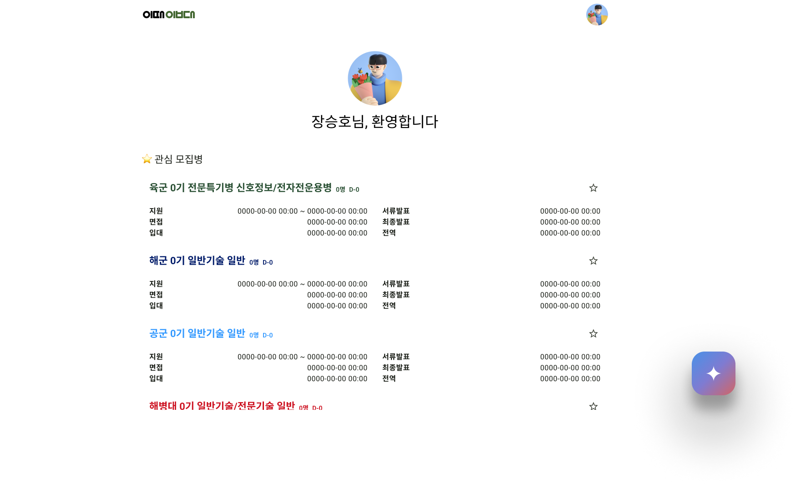

<!-- Improved compatibility of 처음으로 link: See: https://github.com/othneildrew/Best-README-Template/pull/73 -->

<!--
*** Thanks for checking out the Best-README-Template. If you have a suggestion
*** that would make this better, please fork the repo and create a pull request
*** or simply open an issue with the tag "enhancement".
*** Don't forget to give the project a star!
*** Thanks again! Now go create something AMAZING! :D
-->

<!-- PROJECT SHIELDS -->
<!--
*** I'm using markdown "reference style" links for readability.
*** Reference links are enclosed in brackets [ ] instead of parentheses ( ).
*** See the bottom of this document for the declaration of the reference variables
*** for contributors-url, forks-url, etc. This is an optional, concise syntax you may use.
*** https://www.markdownguide.org/basic-syntax/#reference-style-links
-->
[![Contributors][contributors-shield]][contributors-url]
[![Forks][forks-shield]][forks-url]
[![Stargazers][stars-shield]][stars-url]
[![Issues][issues-shield]][issues-url]
[![MIT License][license-shield]][license-url]

<!-- PROJECT LOGO -->
 

  

<h3 align="center">이때입대</h3>

  

    쉽고 빠른 모집병 통합검색 서비스
     
    <a href="https://lets-enlist.web.app"><strong>웹사이트 바로가기 »</strong></a>
     
     
    <strong>2024 국방 공공데이터 활용 경진대회 출품작</strong>
     
     
    <a href="https://www.figma.com/design/P2tx7s6MSax8SiALLR6erd/%EC%9D%B4%EB%95%8C%EC%9E%85%EB%8C%80?node-id=54795-2082&t=4JCeUbMbZfFgIICb-1">디자인</a>
    ·
    <a href="https://www.figma.com/proto/P2tx7s6MSax8SiALLR6erd/%EC%9D%B4%EB%95%8C%EC%9E%85%EB%8C%80?node-id=54795-2082&t=4JCeUbMbZfFgIICb-1">프르토타입</a>
    ·
    <a href="https://www.figma.com/slides/3dHSLqCKa7ZVruMbT41kZZ/%EC%9D%B4%EB%95%8C%EC%9E%85%EB%8C%80?node-id=225-133&t=jabZ27AaAljlOJ0c-1">슬라이드</a>
     
    <a href="https://github.com/hoosong0235/lets-enlist/issues/new?labels=bug&template=bug-report---.md">버그 제보</a>
    ·
    <a href="https://github.com/hoosong0235/lets-enlist/issues/new?labels=enhancement&template=feature-request---.md">기능 요청</a>
  

<!-- ABOUT THE PROJECT -->
## 머리말

  컴공과 대학생인데, 무도단증이 있는데, 봄학기에 복학하고 싶은데, 어떤 모집병에 지원해야 할 지 막막했던 당신. 
  육군, 해군, 공군, 해병대 각각 나누어져 있던 정보에, 기술행정병, 전문특기병, 종류는 또 왜 이렇게 많은 건지. 
  기껏 모집병을 정해도 임무 설명부터, 모집 계획, 평가 요소, 지원 절차까지 <strong>모집병 공고 검색하기 너무 불편하셨죠?</strong> 

     

  이제 걱정하지 마세요. <strong>쉽고 빠른 모집병 통합검색 서비스, 이때입대</strong>를 소개드려요. 
  수십 개의 웹사이트와 첨부파일에 흩어져 있던 모든 모집병 공고를 한 데 모아두었어요. 
  단 한 번의 검색으로 조건에 맞는 모집병 공고를 확인하고, 세부 요강을 만나보세요. 
  오직 당신만을 위한 맞춤 모집병 공고를 추천해주는 이때입대 AI는 덤이에요. 

(<a href="#readme-top">처음으로</a>)

### 활용 기술

* [![Github][Github.js]][Github-url]
* [![Dart][Dart.js]][Dart-url]
* [![Figma][Figma.js]][Figma-url]
* [![Flutter][Flutter.js]][Flutter-url]
* [![Firebase][Firebase.js]][Firebase-url]
* [![GoogleGemini][GoogleGemini.js]][GoogleGemini-url]

(<a href="#readme-top">처음으로</a>)

## 서비스 기능 소개

### 1. 이때입대 AI

     

  이때입대 AI는 모집병 데이터베이스를 학습한 거대 언어 모델이에요. 
  학과, 자격증, 희망하는 입대일과 전역일 등 사용자의 특성을 고려해 맞춤 모집병 공고를 추천해줘요. 
  지원자격과 필요서류 목록부터 지원정보와 입대정보 일정까지 세부 요강도 함께 안내해줘요. 

### 2. 모집병 공고 통합검색

     

  검색어를 입력하고 전공, 군종, 면접 종류, 입대일과 전역일 필터를 설정하여 모집병 공고 통합검색을 시작하세요. 

     

  모집병 데이터베이스에서 조건에 맞는 데이터들이 필터링되어 검색 결과로 표시돼요. 
  모집병 공고에는 모집 인원, 지원 디데이, 중요 일정 등 핵심 정보가 요약되어 있어요. 

### 3. 세부 요강 열람

     

  모집병 공고를 클릭해 세부 요강을 열람해보세요. 
  세부 요강에는 임무 설명부터, 지원자격과 필요서류 목록, 지원정보와 입대정보 일정까지, 모집병 지원에 필요한 모든 정보가 정리되어 있어요. 

### 4. 관심 모집병

     

  즐겨찾기 버튼을 클릭해 모집병 공고를 관심 모집병에 등록할 수 있어요. 
  소셜 계정으로 로그인한 후, 관심 모집병을 한 데 모아 한 눈에 비교해 보세요. 

(<a href="#readme-top">처음으로</a>)

## 서비스 개발 과정

### 1. 디자인 및 프로토타이핑

     

### 2. 시스템 아키텍처 설계

     

(<a href="#readme-top">처음으로</a>)

<!-- LICENSE -->
## License

Distributed under the MIT License. See `LICENSE.txt` for more information.

(<a href="#readme-top">처음으로</a>)

<!-- CONTACT -->
## Contact

Seungho Jang  - develop0235@gmail.com

Project Link: [https://github.com/hoosong0235/lets-enlist](https://github.com/hoosong0235/lets-enlist)

(<a href="#readme-top">처음으로</a>)

<!-- MARKDOWN LINKS & IMAGES -->
<!-- https://www.markdownguide.org/basic-syntax/#reference-style-links -->
[contributors-shield]: https://img.shields.io/github/contributors/hoosong0235/lets-enlist.svg?style=for-the-badge
[contributors-url]: https://github.com/hoosong0235/lets-enlist/graphs/contributors
[forks-shield]: https://img.shields.io/github/forks/hoosong0235/lets-enlist.svg?style=for-the-badge
[forks-url]: https://github.com/hoosong0235/lets-enlist/network/members
[stars-shield]: https://img.shields.io/github/stars/hoosong0235/lets-enlist.svg?style=for-the-badge
[stars-url]: https://github.com/hoosong0235/lets-enlist/stargazers
[issues-shield]: https://img.shields.io/github/issues/hoosong0235/lets-enlist.svg?style=for-the-badge
[issues-url]: https://github.com/hoosong0235/lets-enlist/issues
[license-shield]: https://img.shields.io/github/license/hoosong0235/lets-enlist.svg?style=for-the-badge
[license-url]: https://github.com/hoosong0235/lets-enlist/blob/master/LICENSE.txt

[Github.js]: https://img.shields.io/badge/github-%23121011.svg?style=for-the-badge&logo=github&logoColor=white
[Github-url]: https://github.com/
[Dart.js]: https://img.shields.io/badge/dart-%230175C2.svg?style=for-the-badge&logo=dart&logoColor=white
[Dart-url]: https://dart.dev/
[Figma.js]: https://img.shields.io/badge/figma-%23F24E1E.svg?style=for-the-badge&logo=figma&logoColor=white
[Figma-url]: https://www.figma.com/
[Flutter.js]: https://img.shields.io/badge/Flutter-%2302569B.svg?style=for-the-badge&logo=Flutter&logoColor=white
[Flutter-url]: https://flutter.dev/
[Firebase.js]: https://img.shields.io/badge/firebase-a08021?style=for-the-badge&logo=firebase&logoColor=ffcd34
[Firebase-url]: https://firebase.google.com/
[GoogleGemini.js]: https://img.shields.io/badge/Google%20Gemini-886FBF?logo=googlegemini&logoColor=fff
[GoogleGemini-url]: https://gemini.google.com/
